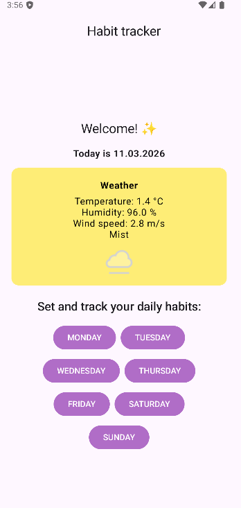
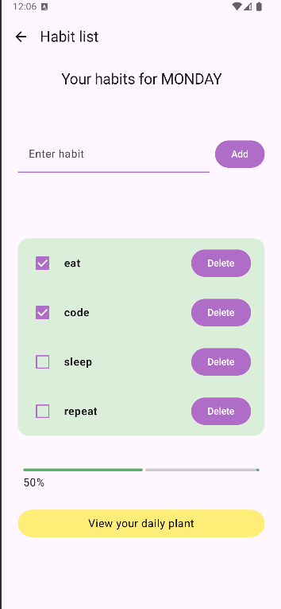
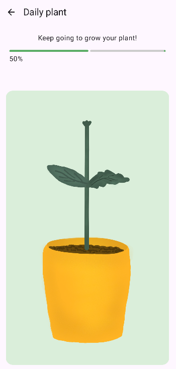
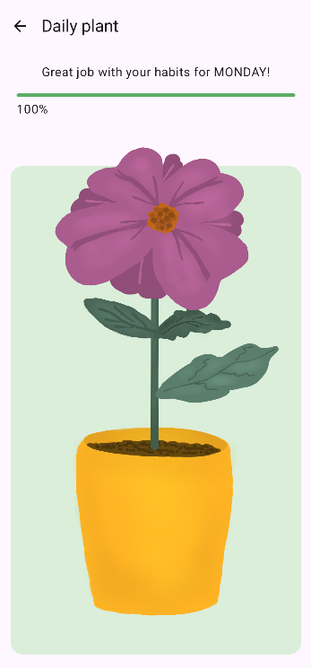
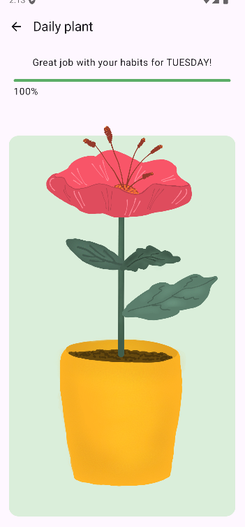
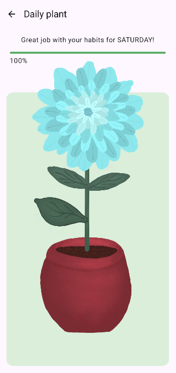

## Daily Habit Tracker

Daily Habit Tracker is an Android app for tracking your daily habits. Users can create, complete, and monitor habits for each day of the week. To motivate consistent habit completion, the app visually grows a plant based on your daily progress. Additionally, the app shows current weather information retrieved from WeatherAPI
.

## Features

- Add, complete and delete daily habits
- Track progress for each day of the week
- Grow a virtual plant as a visual representation of daily habit completion
- Display real-time weather data including temperature, humidity, wind, and condition

## Screenshots
<table>
    <tr>
        <td></td>
        <td></td>
        <td></td>
    </tr>
    <tr>
        <td></td>
        <td></td>
        <td></td>
    </tr>
</table>

## Implementation details

- Built with Jetpack Compose for UI
- Uses ViewModel to manage app state
- Plants are generated dynamically with randomized parts for each day
- Weather data fetched via WeatherAPI https://www.weatherapi.com/ 
- Implements progress calculation and dynamic UI updates

## How to run

- Clone the repository
- Open in Android Studio
- Add your WeatherAPI key in the appropriate configuration file
- Build and run on an emulator or Android device
